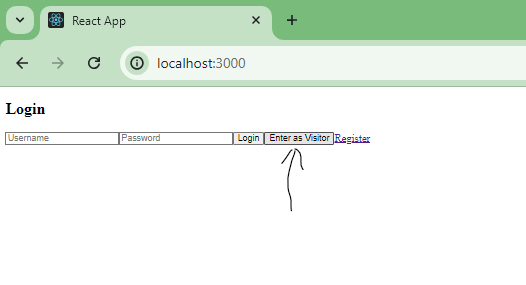
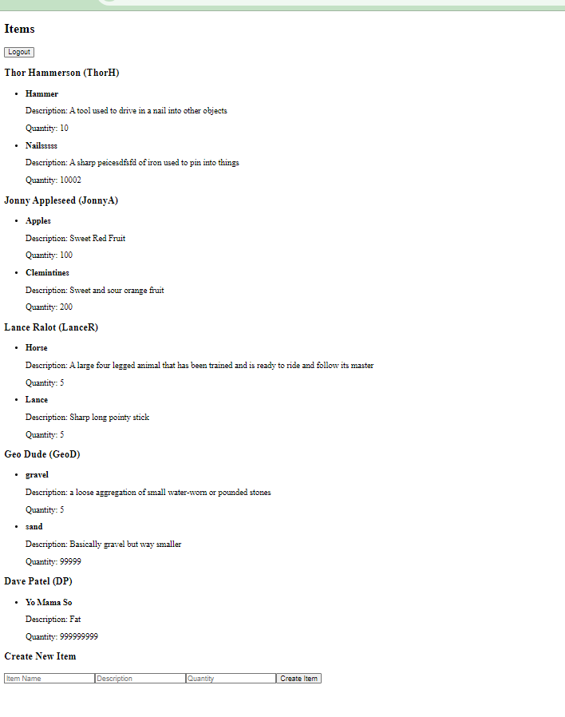
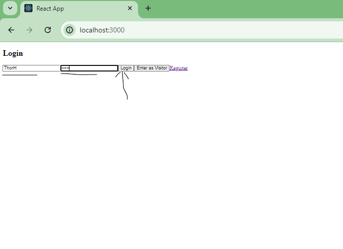

# Z-Prefix-Store-Project
Basic Crud app simulating a store.
This simulates an item management system where users can log in, view their items, create new items, and edit or delete existing items. Visitors can view all items but cannot create, edit, or delete them.

Features incluede:
-User Authentication
-Visitor Mode to view all items without logging in
-Item management for logged-in users to create, edit, and delete their goodds

BackEnd:
Postgresql, Node.js, Express, knex.js

FrontEnd:
React, Axios

Container Management:
Docker

-------------SETUP--------------

Installs needed:
`npm install express`
`npm install pg`
`npx knex init`
`npm install knex --save`
`npm init -y`
`npm i nodemon`
`npm install`
`npm list knex`
`npm install dotenv`

Intall on frontend:
`npm install axios`
`react-router-dom`

---------------Start DATABASE ------------------
Navigate to the server folder
Type the following below
`docker-compose up -d --build`
For the two lines below, may need to open another seperate terminal in the server folder if docker stays up:
`docker-compose exec app npx knex migrate:latest`
`docker-compose exec app npx knex seed:run`
In a seperate terminal: `docker-compose exec db psql -U postgres -d store` -> you can test/view the database here via sql commands
Navigate to /frontend: `npm start` -> front end should now be running on `http://localhost:3000`
-------------------------------------------------

-------------API Endpoints----------------------
Authentication
- POST /login: Log in a user
Users
- POST /users: Create a new user
- GET /users: Get all users
- GET /users/#id
- -  Get a single user by ID
- PUT /users/
- - Update a user by ID
- DELETE /users/
- - Delete a user by ID
Items
- POST /items: Create a new item
- GET /items: Get all items (optionally filter by user ID)
- GET /items/
- - Get a single item by ID
- PUT /items/
 - - Update an item by ID
- DELETE /items/
- - Delete an item by ID

Usage
Visitor
- Navigate to http://localhost:3000
- Click on "Enter as Visitor"
- View all items

User
- Navigate to http://localhost:3000
- Log in using your credentials
- View your items
- Create, edit, and delete items

The base users and their creds are as follows:

      FirstName: "Thor",
      LastName: "Hammerson",
      UserName: "ThorH",
      Password: "thorh",

      FirstName: "Jonny",
      LastName: "Appleseed",
      UserName: "JonnyA",
      Password: "jonnya"

      FirstName: "Lance",
      LastName: "Ralot",
      UserName: "LanceR",
      Password: "lancer",

      FirstName: "Geo",
      LastName: "Dude",
      UserName: "GeoD",
      Password: "geod",

